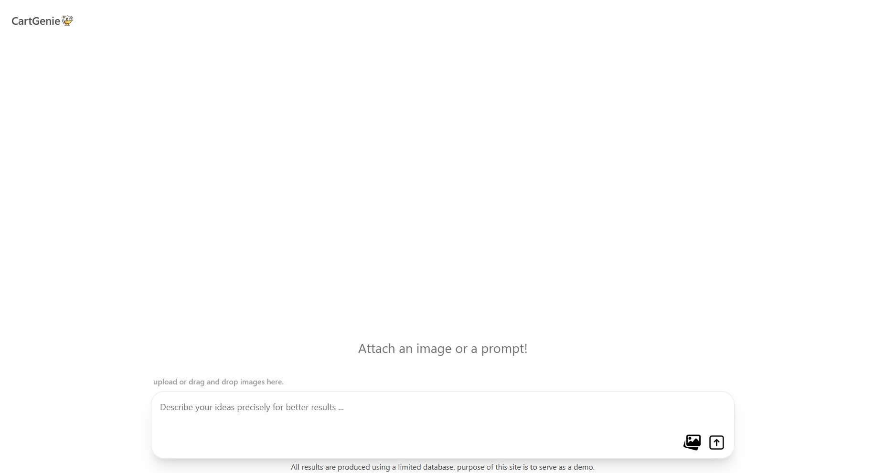

## CartGenie 0.1  
  
search over a database of amazon products using images and prompts.
 
### Disclaimer ⚠️
- This is a demo client backed by limited scraped data of tshirts for men and women.
- No user data is persistantly stored under any instance of the process.

### Future features
- [ ] Support for chat history and it's benefits

### Development Details
- Frontend - React.js
- Server for image embeddings - HuggingFace spaces free tier
- Server for database searching - PostgreSQL hosted on Supabase

rebased from my old depracated repo Cart-Genie (now private)
